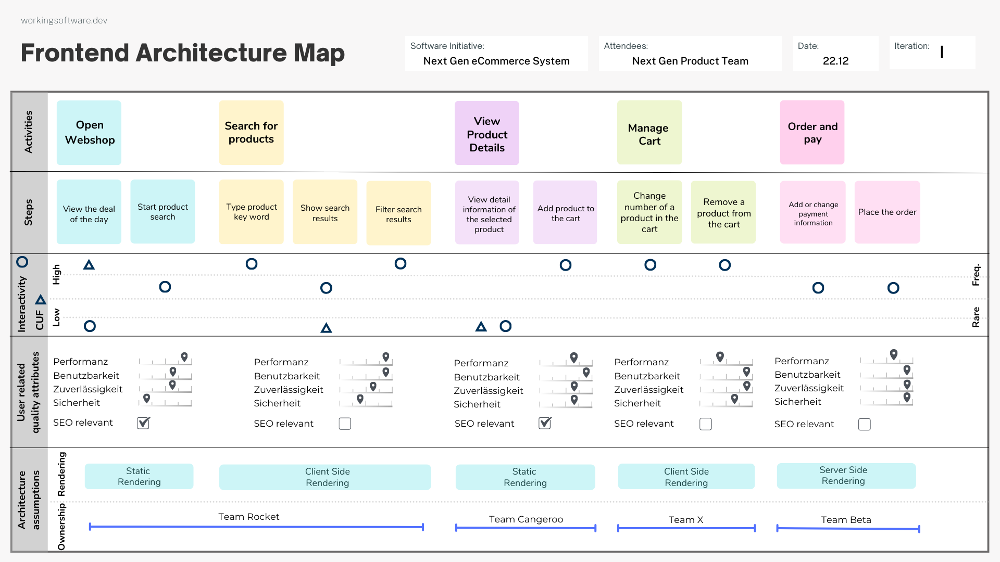

# The Frontend Architecture Map

The Frontend Architecture Map is a powerful collaboration technique that maps the user journey while integrating essential 
architectural considerations for next-generation web applications. It is ideal for cross-functional product teams and ensures the 
development of robust and user-friendly web experiences.

## Summary

- [How to Use](#how-to-use)
- [Section Definition](#section-definitions)
- [Example](#example)
- [Tools](#tools)
- [Design Tips](#design-tips)
- [Additional Resources](#additional-resources)

## How to Use

### Start with a normal user story map.

In story mapping, a user's journey is broken down into the most important user activities and tasks and organized in a visual map. This map is organized horizontally by sequence of activities and vertically by priority or complexity, helping teams understand the flow and identify gaps or opportunities in the user experience. The goal is to agree on what needs to be built, in what order and to what extent.

This is a great starting point for the Frontend Architecture Map.

If you don't have experience with story mapping, you can learn more about it in the book [User Story Mapping: Discover the Whole Story, Build the Right Product](https://amzn.to/4dBS5mc) by Jeff Patton.

More resources:
- [User Story Mapping: A Quick Overview](https://jpattonassociates.com/story-mapping/) by Jeff Patton

### Discuss the interactivity factor

For each user task or activity, discuss the interactivity that will be required. This will help you identify the components that will be needed and how they will interact with each other.

### Discuss the content update frequency (CUF)

For each user task or activity, discuss the content update frequency (CUF) that will be required. 

### Go through the user related quality attributes

For each user task or activity, discuss the user related quality attributes that will be required.

* Performance efficiency
* Usability
* Reliability
* Security

Try to scale the expectation each of these quality attributes from low to high (0 - 4).

And check if the user activity is related to SEO.

### Do first architecture assumptions

#### Rendering

Try to define the rendering strategy for each user task or activity.

* Client-side rendering
* Server-side rendering
* Static site generation

#### App Scope and Ownership

Try to define the app scope and ownership for each user task or activity.