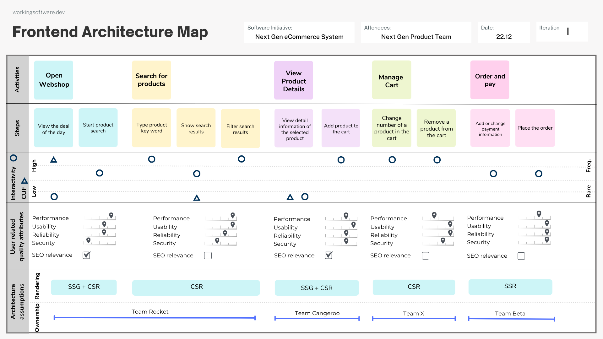

# The Frontend Architecture Map

The Frontend Architecture Map is a powerful collaboration technique that maps the user journey while integrating essential 
architectural considerations for next-generation web applications. It is ideal for cross-functional product teams and ensures the 
development of robust and user-friendly web experiences.

## Summary

- [How to Use](#how-to-use)
- [Tools](#tools)
- [Additional Resources](#additional-resources)

### How to Use

#### Start with a user story map

In story mapping, a user's journey is broken down into the most important user activities and tasks and organized in a visual map. This map is organized horizontally by sequence of activities and vertically by priority or complexity, helping teams understand the flow and identify gaps or opportunities in the user experience. The goal is to agree on what needs to be built, in what order and to what extent.

This is a great starting point for the Frontend Architecture Map.

If you don't have experience with story mapping, you can learn more about it in the book [User Story Mapping: Discover the Whole Story, Build the Right Product](https://amzn.to/4dBS5mc) by Jeff Patton.

More resources:
- [User Story Mapping: A Quick Overview](https://jpattonassociates.com/story-mapping/) by Jeff Patton

#### Discuss the interactivity factor

For each user task or activity, discuss the interactivity factor that will be required. This will help you identify the components that will be needed and how they will interact with each other.

Discuss if the interaction with the web app on this task will be:

* No interaction, just view (0)
    * View static content without any interaction. E.g. read a blog post.
* Low interaction (1)
    * Simple interactions like clicking a button or filling a form. E.g. a contact form.
* Medium interaction (2)
    * Partially dynamic feedback on interactions, e.g. a search form with results.
* High interaction (3)
    * Highly dynamic interactions with real-time answers, e.g. a chat application.

#### Discuss the content update frequency (CUF)

For each user task or activity, discuss the content update frequency (CUF) that will be required. 

Discuss for each of this activity or task how often the content will be updated:

* Rare (0)
    * The content is updated very rarely, e.g. < once a month.
* Occasional (1)
    * The content is updated occasionally, e.g. 1-3 times a month.
* Regularly (2)
    * The content is updated regularly, e.g. 1-3 times a week.
* Frequent (3)
    * The content is updated frequently, e.g. > 3 times a week or on a daily basis.

#### Go through the user expectations (user related quality attributes)

For each user task or activity, discuss the user related quality attributes that will be required.

* Performance efficiency
* Usability
* Reliability
* Security

Try to scale the expectation each of these quality attributes from low to high (0 - 4).

And check if the specific task is related to SEO.

#### Do first architecture assumptions

The corresponding rendering technique does highly influence the architecture of the frontend and gives requirements for your technology. Therefore, it is important to define the rendering strategy for each user task or activity.

##### Rendering

>
> ***Rendering*** = Template ("preliminary markup") + Data = Displayed Web Page
>

Try to define the rendering strategy for each user task or activity:

* ***SSR (Server-Side Rendering)***: Used when content is updated regularly or frequently, and when there's a need for dynamic interaction at a medium level. This ensures that the content is rendered on the server side, with minimal client-side interaction needed.

* ***CSR (Client-Side Rendering)***: Best for highly dynamic applications where the interaction level is high, and content may change frequently. Client-side rendering allows for real-time updates and interactivity without relying on server-side rendering.    

* ***SSG (Static Site Generation)***: Ideal for static content that doesn't require frequent updates or interactivity. Suitable when content updates are rare or occasional and the interactivity is minimal.

* ***SSG + CSR (Static Site Generation with Client-Side Rendering)***: Suitable when content is mostly static but with some low-level interaction, such as forms or buttons. This combination allows for static rendering the content while adding interactivity on the client side.

* ***SSR + CSR (Server-Side Rendering with Client-Side Hydration)***: Appropriate when the content updates more regularly or requires a medium level of interactivity. Server-side rendering ensures that the content is up-to-date when served, while client-side hydration adds dynamic behavior.

* ***SSG+SSR (Incremental Static Regeneration, ISR)*** is ideal when you want to serve primarily static content but also ensure that updates can happen on-demand without rebuilding the entire site. It's particularly useful for content that needs to be up-to-date but isn't highly dynamic, fitting between SSG and SSR in terms of flexibility and performance.

###### Table for Orientation

> Disclaimer: This table is a guideline and should be adapted to your specific quality requirements and constraints.

| **Interactivity Factor \ Content Update Frequency** | **Rare (0)** | **Occasional (1)** | **Regularly (2)** | **Frequent (3)** |
|-----------------------------------------------------|--------------|--------------------|-------------------|------------------|
| **No interaction (0)**                              | **SSG**      | **SSG**            | **ISR (SSG+SSR)** | **SSG + CSR**    |
| **Low interaction (1)**                             | **SSG + CSR**| **ISR (SSG+SSR)**  | **ISR (SSG+SSR)** | **SSR + CSR**    |
| **Medium interaction (2)**                          | **SSG + CSR**| **SSR + CSR**      | **SSR**           | **SSR + CSR**    |
| **High interaction (3)**                            | **CSR**      | **CSR**            | **CSR**           | **CSR**          |

##### App Scope and Ownership

Try to define the app scope and ownership for each user task or activity.

The organisation of your company and the team structure will influence the architecture of your frontend. Therefore, it is important to define the app scope and ownership for each user task or activity.

### Tools

#### English
* [PNG](resources/template/template-frontend-architecture-map-en.png)